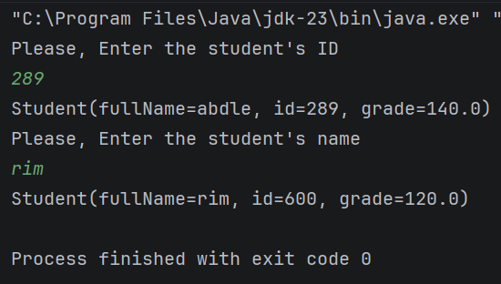

# Kotlin Nullability : !! et ?:

Un programme console Kotlin qui explore la gestion de la nullabilite a travers une recherche d'etudiants par ID et par nom.

---

## Description

Ce lab met en pratique les operateurs de nullabilite en Kotlin a travers deux fonctionnalites :

- **Recherche par ID** : retourne l'etudiant correspondant ou declenche une `NullPointerException` si introuvable (`!!`)
- **Recherche par nom** : retourne l'etudiant ou affiche un message par defaut si introuvable (`?:`)

---

## Objectifs du Lab

Comprendre et mettre en pratique :
- Le type nullable `Student?` vs non-nullable `Student`
- L'operateur `!!` (non-null assertion) et le risque de `NullPointerException`
- L'operateur Elvis `?:` pour fournir une valeur par defaut
- La `data class` pour modeliser des donnees
- La fonction `find { }` avec une lambda pour chercher dans une liste
- `readln()` pour lire une entree utilisateur dans la console

---

## Pre-requis

- **IntelliJ IDEA** (ce lab necessite la console interactive, pas Kotlin Playground)
- Savoir ecrire `fun main()` et manipuler des listes

---

## Structure des Donnees

### Data Class `Student`

```kotlin
data class Student(val fullName: String, var id: Int, var grade: Double)
```

| Propriete | Type | Role |
|---|---|---|
| `fullName` | `String` | nom complet de l'etudiant |
| `id` | `Int` | identifiant unique |
| `grade` | `Double` | note de l'etudiant |

### Liste des Etudiants

```kotlin
val students = listOf(
    Student("abdle", 289, 140.0),
    Student("rim",   600, 120.0),
    Student("nour",  342,  76.0),
    Student("yuss",  776, 130.0)
)
```

| Nom | ID | Note |
|---|---|---|
| abdle | 289 | 140.0 |
| rim | 600 | 120.0 |
| nour | 342 | 76.0 |
| yuss | 776 | 130.0 |

---

## Fonctions

### `getStudentById` — retour non-nullable avec `!!`

```kotlin
fun getStudentById(id: Int): Student {
    return students.find { it.id == id }!!
}
```

- `find { it.id == id }` retourne `Student?` (nullable)
- `!!` force le type a `Student` non-nullable
- Si l'ID n'existe pas, `find` retourne `null` et `!!` declenche une `NullPointerException`

### `searchInStudents` — retour nullable avec `?:`

```kotlin
fun searchInStudents(name: String): Student? {
    return students.find { it.fullName.lowercase() == name.lowercase() }
}
```

- Retourne `Student?` : peut etre `null` si le nom n'est pas trouve
- `.lowercase()` rend la recherche insensible a la casse

---

## Code Complet

```kotlin
data class Student(val fullName: String, var id: Int, var grade: Double)

val students = listOf(
    Student("abdle", 289, 140.0),
    Student("rim",   600, 120.0),
    Student("nour",  342,  76.0),
    Student("yuss",  776, 130.0)
)

fun getStudentById(id: Int): Student {
    return students.find { it.id == id }!!
}

fun searchInStudents(name: String): Student? {
    return students.find { it.fullName.lowercase() == name.lowercase() }
}

fun main() {
    println("Please, Enter the student's ID")
    val id = readln().toInt()
    println(getStudentById(id))

    println("Please, Enter the student's name")
    val name = readln()
    println(searchInStudents(name) ?: "the student is not found")
}
```

---

## Comparaison des Deux Approches

| | `getStudentById` | `searchInStudents` |
|---|---|---|
| Type retourne | `Student` (non-nullable) | `Student?` (nullable) |
| Operateur | `!!` | `?:` (Elvis) |
| Si introuvable | `NullPointerException` | affiche `"the student is not found"` |
| Usage recommande | quand l'absence est une erreur critique | quand l'absence est un cas normal |

---

## Resultats Attendus

**Cas 1 — ID valide (`289`) :**
```
Please, Enter the student's ID
289
Student(fullName=abdle, id=289, grade=140.0)
```

**Cas 2 — ID invalide (`999`) :**
```
Please, Enter the student's ID
999
Exception in thread "main" java.lang.NullPointerException
```

**Cas 3 — Nom valide (`rim`) :**
```
Please, Enter the student's name
rim
Student(fullName=rim, id=600, grade=120.0)
```

**Cas 4 — Nom introuvable (`ali`) :**
```
Please, Enter the student's name
ali
the student is not found
```

---

## Concepts Cles

- **`data class`** — classe optimisee pour les donnees : genere automatiquement `toString()`, `equals()`, `copy()`
- **`Student?`** — type nullable, peut contenir `null`
- **`!!`** — non-null assertion : force la valeur, crash si `null`
- **`?:`** — operateur Elvis : retourne la valeur de gauche si non-null, sinon celle de droite
- **`find { }`** — cherche le premier element qui satisfait la condition, retourne `null` si aucun
- **`readln()`** — lit une ligne saisie par l'utilisateur dans la console

---

## Lancer le Projet

1. Cloner le depot :
   ```bash
   git clone https://github.com/votre-utilisateur/kotlin-nullability.git
   ```
2. Ouvrir le projet dans **IntelliJ IDEA**
3. Executer `main.kt` avec le bouton Run et interagir avec la console

---

## Technologies


---

## Licence

Ce projet est realise dans le cadre d'un laboratoire pedagogique.

---

## Screenshot




